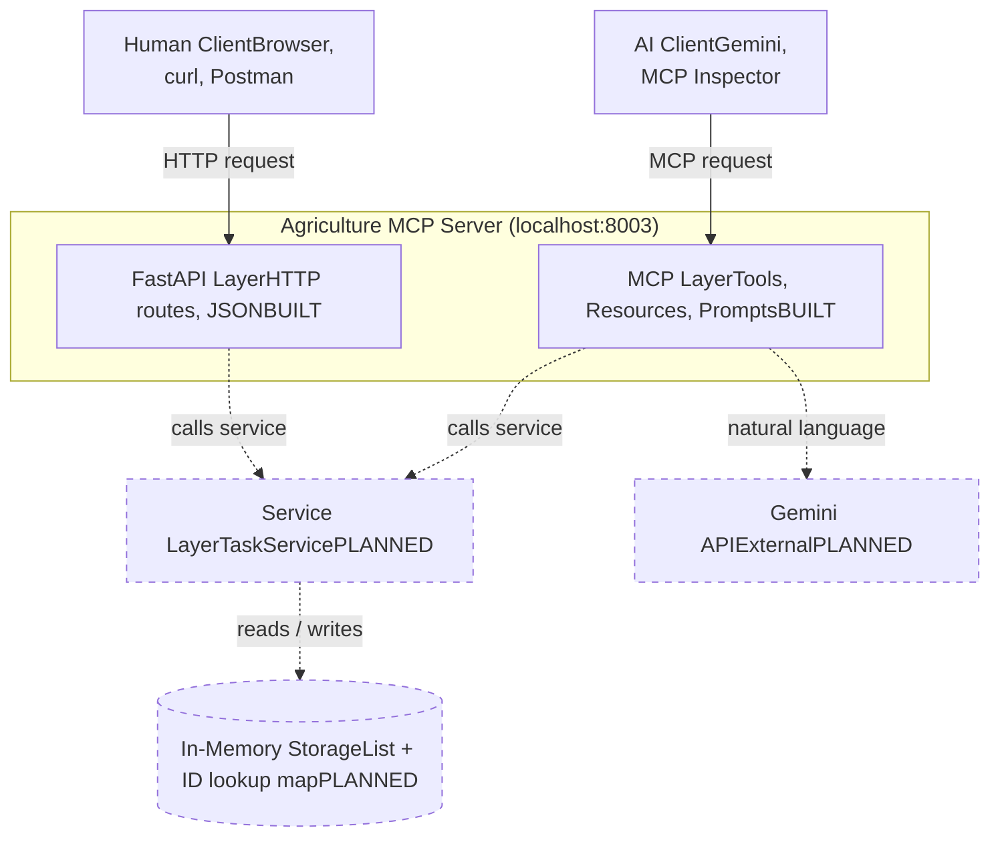

# Architecture

Some intro paragraph here explaining the architecture...

## System Diagram

## Legend

- **Solid border** = built today (as of 05/24/2026)
- **Dashed border** = planned, not yet built

(...more content like the folder map table...)