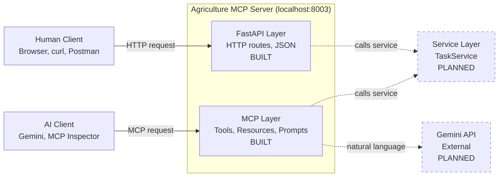

# Architecture

The Agriculture MCP Server has 2 system entry points:
FastAPI for human or software users, and an MCP layer for
AI clients. Both funnel into the Service Layer where the
logic lives. Solid lines and borders indicate what is
already built, dashed lines and borders show what is
planned but not yet built.

## System Diagram

## Legend

- **Solid border** = built today (as of 05/24/2026)
- **Dashed border** = planned, not yet built

(...more content like the folder map table...)